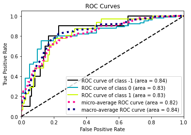
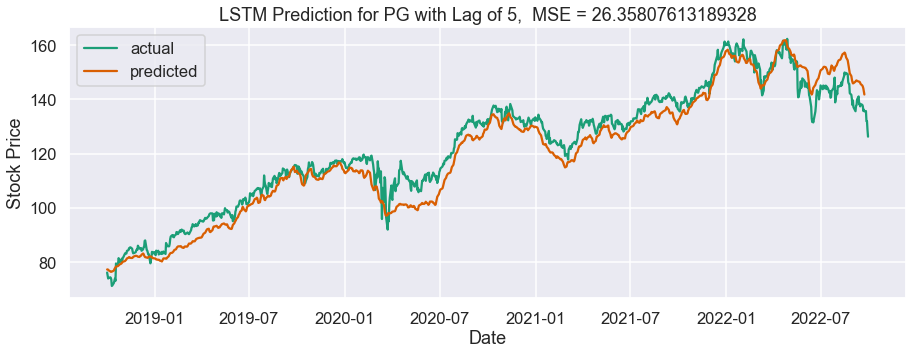
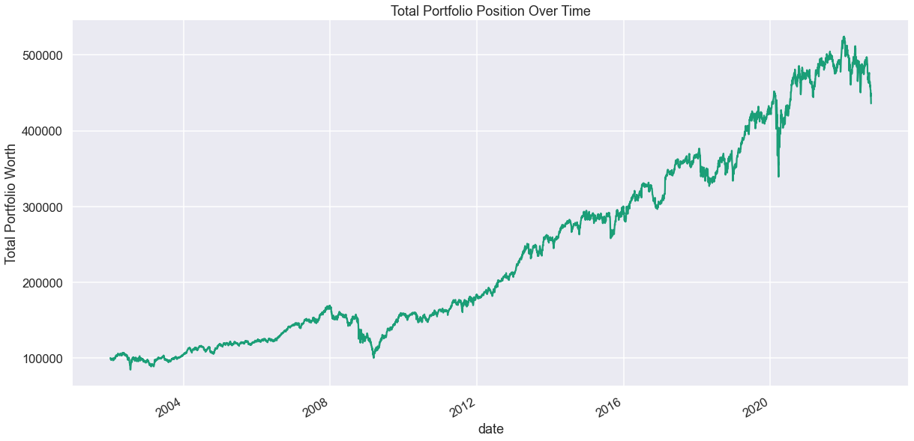

# Jarrod-Mautz-Portfolio
This is my ongoing Data Science and Quant Portfolio!

# [Project 1: NBA Player Clustering: Project Overview]() 
- Scraped Stats.NBA.com to aggregate data.
- Utilize PCA to perfom dimension reduction. 
- perform Hopkins test to verify clustering tendencies
- used KMeans++ clustering algorithm to group players together.
- Analyze clusters to identify play styles/archetypes.

# [Project 2: Twitter Sentiment Analysis: Project Overview](https://github.com/jarrod7800/Twitter-Sentiment-Analysis/blob/main/Twitter_Sentiment_Analysis/sentiment_models.ipynb)
- Utilized object oriented programing and the Tweepy API to scrape recent tweets and other data related to 'Bitcoin'.
- Manually analyze tweets for sentiment and assign a label (manually to reduce redundancy).
- Perfomed data preprocessing to clean each tweet. 
- Balance dataset using SMOTE and then fit various classification models to text.
- Identify top two performing models.

# [Project 3: LSTM Stock Price Model vs Naive Model: Project Overview](https://github.com/jarrod7800/Stock-Projects/blob/master/Stock%20LSTM/Stock_Prediction_LSTM.ipynb)
- Explore stock price prediction possibilities and create model to try and beat naive forecast.
- Three different financial APIs were utilized to access historic economic data, OHLC data, and economic indicators.
- Engineered and preprocessed time series features into 3D sequential data for LSTM Input.
- Use Keras to build LSTM model fit on historical data from five different consumer goods companies. 
- Create various visualizations to compare predicted prices to naive model.

# [Project 4: Stock Portfolio Simulator and Analyzer: Project Overview](https://github.com/jarrod7800/Stock-Projects/blob/master/Stock%20Portfolio/PortfolioCreation_andFinancialStatistics.ipynb)
- Use scraped stock data to create a small simulated portfolio of consumer goods companies.
- Display weighted portfolio positions for each stock and track performance over time.
- Calculate cumulative return and other statistics such as Sharpe and Sortino ratios for our portfolio.
- Create a monte carlo simulation to predict VaR for Procter & Gamble stock price for Q4’ of 2022.
- Markowitz Efficient Frontier for portfolio coming soon!

